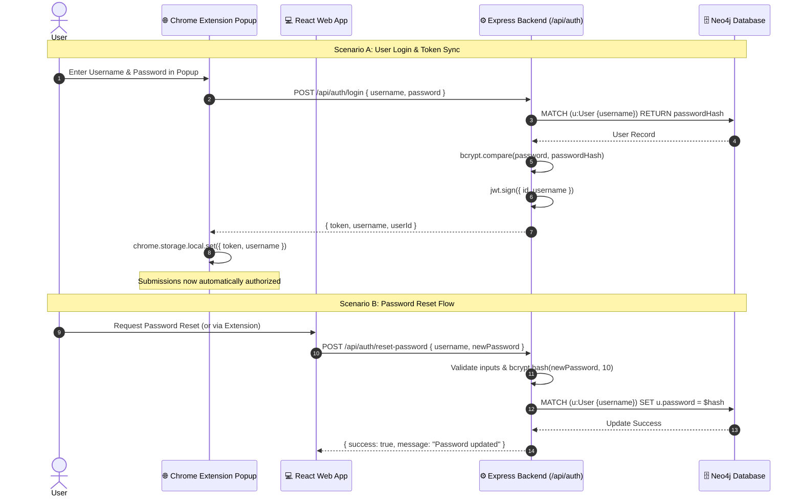

# 📐 System Architecture & Data Flowcharts

This document outlines the complete end-to-end architecture of the **GraphRAG Mentor** system, covering the **Authentication & Identity Sync Pipeline**, the **Data Ingestion Pipeline**, the **gRPC AI Gateway & GraphRAG Pipeline**, and the **Docker Container Infrastructure**.

---

## Table of Contents
1. [System Overview & Microservice Topology](#-system-overview--microservice-topology)
2. [Flow 1: Authentication, Token Sync & Password Management](#-flow-1-authentication-token-sync--password-management)
3. [Flow 2: Data Ingestion Pipeline (Extension ➔ Neo4j & Embeddings)](#-flow-2-data-ingestion-pipeline-extension--neo4j--embeddings)
4. [Flow 3: AI Mentor Query, Routing & gRPC AI Gateway Flow](#-flow-3-ai-mentor-query-routing--grpc-ai-gateway-flow)
5. [Flow 4: Docker Container Network Architecture](#-flow-4-docker-container-network-architecture)

---

# 🌐 System Overview & Microservice Topology

```
┌─────────────────────────────────────────────────────────────────────────────────────────┐
│                                    CLIENT APPLICATIONS                                  │
│                                                                                         │
│   ┌─────────────────────────────────────────┐   ┌───────────────────────────────────┐   │
│   │         💻 React Frontend (SPA)         │   │      🌐 Chrome Extension (MV3)    │   │
│   │    • AI Mentor Chat & Analytics         │   │    • LeetCode DOM Extraction      │   │
│   │    • Auth & Password Reset Pages        │   │    • Popup Auth / Reset UI        │   │
│   └────────────────────┬────────────────────┘   └─────────────────┬─────────────────┘   │
└────────────────────────┼──────────────────────────────────────────┼─────────────────────┘
                         │                                          │
                         │ HTTP REST (JSON / SSE)                   │ HTTP POST (Bearer Token)
                         ▼                                          ▼
┌─────────────────────────────────────────────────────────────────────────────────────────┐
│                         ⚙️ CORE BACKEND MICROSERVICE (minor_backend)                    │
│                                                                                         │
│   • Express.js API Server (Port 3000)                                                   │
│   • JWT Auth Verification & Rate Limiters (Sliding Window)                              │
│   • Intent Query Router (Text-to-Cypher vs GraphRAG)                                    │
│   • Context Minification & Subgraph Expansion                                           │
└──────────────┬──────────────────────────┬─────────────────────────────┬─────────────────┘
               │                          │                             │
               │ Cypher (Bolt)            │ Binary Search & Cache       │ gRPC / Protobuf (HTTP/2)
               ▼                          ▼                             ▼
┌──────────────────────────┐┌──────────────────────────┐┌─────────────────────────────────┐
│   🗄️ NEO4J GRAPH DB      ││   ⚡ REDIS & TYPESENSE   ││   🤖 AI GATEWAY MICROSERVICE    │
│                          ││                          ││      (minor_ai_gateway)         │
│ • User / Problem Nodes   ││ • Exact SHA-256 Cache    ││                                 │
│ • Submission Graph       ││ • Semantic Vector Cache  ││ • Port 50051 (gRPC Server)      │
│ • Native Vector Index    ││ • Typesense Full-Text    ││ • Multi-LLM Provider Engine     │
│ • Constraints & Indexes  ││   History Search Index   ││   (Gemini ➔ Groq ➔ OpenRouter)  │
└──────────────────────────┘└──────────────────────────┘└─────────────────────────────────┘
```

---

# 🔐 Flow 1: Authentication, Token Sync & Password Management

### 1.1 Mermaid Diagram



### 1.2 Boxed ASCII Diagram

```
┌─────────────────────────────────────────────────────────────────────────┐
│              🔐 AUTHENTICATION & SYNC (Web & Extension)                 │
└─────────────────────────────────────────────────────────────────────────┘
   │
   ├─► [User Login via Extension Popup / Web App]
   │     │
   │     ▼
   │   POST /api/auth/login ──► Verify bcrypt hash ──► Issue JWT
   │     │
   │     ▼
   │   Saved in chrome.storage.local (Extension) & localStorage (Web App)
   │
   └─► [Password Reset Workflow]
         │
         ▼
       POST /api/auth/reset-password ──► Hash with Salt(10) ──► Neo4j SET u.password
```

---

# 📦 Flow 2: Data Ingestion Pipeline (Extension ➔ Neo4j & Embeddings)

### 2.1 Mermaid Diagram

```mermaid
flowchart TD
    subgraph Browser ["🌐 Chrome Extension (LeetCode)"]
        A["User submits code on LeetCode"] --> B["content.js triggers on submission completion"]
        B --> C["Extract Metadata:
        • Problem Name & URL
        • Monaco Editor Code
        • Topics / Tags
        • Status (Accepted, TLE, Wrong Answer, etc.)
        • Error String / Test Case"]
        C --> D["Read JWT from chrome.storage.local"]
        D --> E["background.js sends POST /save-submission with Bearer Token"]
    end

    subgraph Backend_Ingest ["⚙️ Express Backend"]
        E --> F["JWT Auth Middleware & Validate Payload"]
        F --> G["mistakeClassifier.js:
        Map error & status to pedagogical mistake pattern"]
        
        subgraph Neo4j_Graph ["📦 Neo4j Knowledge Graph Construction"]
            G --> H["Execute Cypher Query:
            • MERGE (u:User {id})
            • MERGE (p:Problem {name})
            • CREATE (s:Submission {code, status, timestamp})
            • CREATE (e:Error {type})
            • CREATE (m:Mistake {type})
            • MERGE (t:Topic {name})
            • Connect Relationships:
              (u)-[:MADE]->(s)
              (s)-[:FOR]->(p)
              (s)-[:HAS_ERROR]->(e)
              (s)-[:HAS_MISTAKE]->(m)
              (p)-[:BELONGS_TO]->(t)"]
        end

        subgraph Vectorization ["🧠 Vector Storage Pipeline"]
            H --> I["embeddingService.js:
            Build text representation & generate 768-dim Gemini vector"]
            I --> J["SET s.embedding = $vector on Submission node"]
        end
    end

    J --> K(["✅ Submission Stored in Knowledge Graph & Ready for GraphRAG"])
```



### 2.2 Boxed ASCII Diagram

```
┌─────────────────────────────────────────────────────────────┐
│                 🌐 CHROME EXTENSION (LeetCode)              │
│                                                             │
│  • User submits code on LeetCode                            │
│  • content.js extracts:                                     │
│     - Problem Name & URL                                    │
│     - Monaco Editor Code                                    │
│     - Status (Accepted, TLE, Wrong Answer, Runtime Error)   │
│     - Error string / Failed test case input                 │
│     - Problem Topic Tags                                    │
│  • Retrieves JWT Token from chrome.storage.local            │
└──────────────────────────────┬──────────────────────────────┘
                               │
                               │  chrome.runtime.sendMessage()
                               ▼
┌─────────────────────────────────────────────────────────────┐
│                 📡 EXTENSION BACKGROUND SCRIPT              │
│                                                             │
│  • Sends HTTP POST /save-submission to Backend              │
│  • Headers: Authorization: Bearer <JWT_TOKEN>               │
│  • Payload: { userId, problem, code, status, error, topics }│
└──────────────────────────────┬──────────────────────────────┘
                               │
                               │  HTTP POST (JSON)
                               ▼
┌─────────────────────────────────────────────────────────────┐
│               ⚙️ EXPRESS BACKEND (server.js)                │
│                                                             │
│  • JWT Authentication & User verification                   │
│  • utils/mistakeClassifier.js:                              │
│     - Maps error & status to human-readable mistake reason  │
│     - Handles TLE ("Not optimized approach")                │
│     - Handles Accepted ("Solution is correct...")           │
└──────────────────────────────┬──────────────────────────────┘
                               │
                               │  Cypher Execution (driver.session)
                               ▼
┌─────────────────────────────────────────────────────────────┐
│                🗄️ NEO4J KNOWLEDGE GRAPH ENGINE              │
│                                                             │
│  • MERGE (u:User {id})                                      │
│  • MERGE (p:Problem {name})                                 │
│  • CREATE (s:Submission {code, status, timestamp})          │
│  • CREATE (e:Error {type})                                  │
│  • CREATE (m:Mistake {type})                                │
│  • MERGE (t:Topic {name})                                   │
│  • Connect Relationships:                                   │
│     (u)-[:MADE]->(s)-[:FOR]->(p)-[:BELONGS_TO]->(t)         │
│     (s)-[:HAS_ERROR]->(e), (s)-[:HAS_MISTAKE]->(m)          │
└──────────────────────────────┬──────────────────────────────┘
                               │
                               │  Returns submissionId
                               ▼
┌─────────────────────────────────────────────────────────────┐
│              🧠 GEMINI EMBEDDING PIPELINE                   │
│                                                             │
│  • utils/embeddingService.js:                               │
│     - Composes text representation of submission            │
│     - Calls gemini-embedding-001 (768 dimensions)           │
│  • Stores vector directly on node:                          │
│     MATCH (s) SET s.embedding = $vector                     │
└──────────────────────────────┬──────────────────────────────┘
                               │
                               ▼
┌─────────────────────────────────────────────────────────────┐
│       ✅ STORED & INDEXED (Ready for GraphRAG Search)       │
└─────────────────────────────────────────────────────────────┘
```

---

# 🧠 Flow 3: AI Mentor Query, Routing & gRPC AI Gateway Flow

### 3.1 Mermaid Diagram

```mermaid
flowchart TD
    subgraph Frontend ["💻 React Frontend"]
        Q["User asks question in AI Mentor chat"] --> R["Send POST /query with Bearer JWT Token"]
    end

    subgraph Backend_Gateway ["🛡️ Backend Entry & Cache Layer"]
        R --> S["JWT Authentication & User Rate Limiter"]
        S --> T{"1. Exact Hash Cache (Redis SHA-256)"}
        T -- "Exact Hit" --> CACHE_HIT["Return Cached Response (~2ms)"]
        T -- "Miss" --> U{"2. Semantic Cache (Cosine Sim > 0.92)"}
        U -- "Semantic Hit" --> CACHE_HIT
        U -- "Miss" --> V["Query Router: classifyQuery(prompt)"]
    end

    subgraph Router ["🔀 Query Router (LLM Classification)"]
        V --> W{"Classify Query Intent"}
        W -- "Summary / Aggregation / Counts" --> PATH_ANALYTICAL["📊 ANALYTICAL MODE"]
        W -- "Pattern Detection / Problem Specific" --> PATH_CONTEXTUAL["🔍 CONTEXTUAL MODE"]
    end

    subgraph Analytical_Pipeline ["📊 Analytical Path (Text-to-Cypher)"]
        PATH_ANALYTICAL --> A1["llmService.js: Generate Cypher from Schema"]
        A1 --> A2["queryExecutor.js: Enforce LIMIT 25 & Execute Read Transaction"]
        A2 --> A3["Query Neo4j Graph"]
        A3 --> A4["resultFormatter.js: Format records into clean JSON"]
    end

    subgraph Contextual_Pipeline ["🔍 Contextual Path (GraphRAG)"]
        PATH_CONTEXTUAL --> C1["embeddingService.js: Generate Vector for Prompt"]
        C1 --> C2["Neo4j Vector Search:
        CALL db.index.vector.queryNodes('submission_embedding', topK, $embedding)"]
        C2 --> C3["expandSubgraph():
        1-2 Hop Traversal to fetch Problem, Topic, Error, Mistake"]
        C3 --> C4["Rank & Sort matches by Similarity Score"]
    end

    subgraph Synthesis ["🗜️ Context Minification & Prompt Building"]
        A4 --> M1["pruneData() & minifyRecord():
        Strip nulls, empty arrays, internal metadata"]
        C4 --> M1
        M1 --> M2["Build Compact Prompt (Rules + Minified Data)"]
    end

    subgraph gRPC_Client ["🔌 Backend gRPC Client (service/aiGateway.js)"]
        M2 --> GC["Call minor_ai_gateway via gRPC (aigateway.proto)
        rpc StreamText(TextRequest) returns (stream TokenChunk)"]
    end

    subgraph AI_Gateway_Service ["🤖 Standalone AI Gateway Microservice (Port 50051)"]
        GC --> G1{"Primary Provider: Google Gemini Flash"}
        G1 -- "Success / Stream" --> GW_STREAM["Stream Chunks over HTTP/2"]
        G1 -- "429 Rate Limit / Error" --> G2{"Fallback 1: Groq LPU (Qwen)"}
        G2 -- "Success / Stream" --> GW_STREAM
        G2 -- "Fail" --> G3{"Fallback 2: OpenRouter (Gemma 3)"}
        G3 -- "Success / Stream" --> GW_STREAM
    end

    subgraph Storage_Sync ["💾 Persistence & Sync"]
        GW_STREAM --> SYNC1["Save Chat to Neo4j (:ChatHistory)"]
        GW_STREAM --> SYNC2["Index into Typesense"]
        GW_STREAM --> SYNC3["Set Exact & Semantic Redis Cache (TTL: 10m / 30m)"]
    end

    GW_STREAM --> OUT(["🖥️ Live Markdown Streamed to React Frontend"])
```



### 3.2 Boxed ASCII Diagram

```
┌─────────────────────────────────────────────────────────────┐
│                    💻 REACT FRONTEND CHAT                   │
│                                                             │
│  • User enters prompt: "Why am I failing Tree questions?"   │
│  • Sends POST /query with Bearer JWT Token                  │
└──────────────────────────────┬──────────────────────────────┘
                               │
                               │  HTTP POST (Bearer Token)
                               ▼
┌─────────────────────────────────────────────────────────────┐
│              🛡️ AUTH & TWO-TIER REDIS CACHING               │
│                                                             │
│  • Verify JWT Token + Apply User Sliding Window Limiter     │
│                                                             │
│  [Tier 1: Exact Cache]                                      │
│   └─ SHA-256 Hash of prompt found in Redis?                 │
│        ├─► (YES) ──► Return response instantly (<2ms) ──────┼──┐
│        └─► (NO)                                             │  │
│  [Tier 2: Semantic Vector Cache]                            │  │
│   └─ Embed question ➔ Cosine Similarity > 0.92?             │  │
│        ├─► (YES) ──► Return cached response (~10ms) ────────┼──┤
│        └─► (NO)                                             │  │
└──────────────────────────────┬──────────────────────────────┘  │
                               │ (Cache Miss)                    │
                               ▼                                 │
┌─────────────────────────────────────────────────────────────┐  │
│             🔀 QUERY ROUTER (AI Classification)             │  │
│                                                             │  │
│  • Classifies query intent into one of two pipelines:       │  │
└──────────────┬──────────────────────────────┬───────────────┘  │
               │                              │                  │
      [ANALYTICAL MODE]              [CONTEXTUAL MODE]           │
      (Counts, Trends, History)      (Why did I fail? Patterns)  │
               │                              │                  │
               ▼                              ▼                  │
┌─────────────────────────────┐┌─────────────────────────────┐   │
│   📊 TEXT-TO-CYPHER PATH    ││     🔍 GRAPHRAG PATH        │   │
│                             ││                             │   │
│ 1. llmService.js:           ││ 1. Embed user query using   │   │
│    Generate Cypher from DB  ││    Gemini Embeddings        │   │
│    Schema + Rules           ││                             │   │
│ 2. queryExecutor.js:        ││ 2. Neo4j Native Vector      │   │
│    Auto-appends LIMIT 25    ││    Search (Top-K matches)   │   │
│    Runs Read Transaction    ││                             │   │
│ 3. resultFormatter.js:      ││ 3. expandSubgraph():        │   │
│    Converts Neo4j records   ││    1-2 hop graph expansion  │   │
│    to clean JSON            ││    (Problem, Error, Topic)  │   │
└──────────────┬──────────────┘└──────────────┬──────────────┘   │
               │                              │                  │
               └──────────────┬───────────────┘                  │
                              │ Raw Context                      │
                              ▼                                  │
┌─────────────────────────────────────────────────────────────┐  │
│          🗜️ CONTEXT PRUNING & DATA MINIFICATION             │  │
│                                                             │  │
│  • Strips nulls, empty arrays, redundant internal IDs       │  │
│  • Compacts JSON / Shortens prompt rules (Saves ~65% tokens)│  │
└──────────────────────────────┬──────────────────────────────┘  │
                               │ Minified Prompt                 │
                               ▼                                 │
┌─────────────────────────────────────────────────────────────┐  │
│      🔌 BACKEND gRPC CLIENT (service/aiGateway.js)          │  │
│                                                             │  │
│  • Protobuf contract: aigateway.proto                       │  │
│  • Calls minor_ai_gateway:50051 over HTTP/2                 │  │
└──────────────────────────────┬──────────────────────────────┘  │
                               │ gRPC StreamText Call            │
                               ▼                                 │
┌─────────────────────────────────────────────────────────────┐  │
│      🤖 STANDALONE gRPC AI GATEWAY (minor_ai_gateway)       │  │
│                                                             │  │
│   ┌─────────────────────────────────────────────────────┐   │  │
│   │ 1. Primary: Google Gemini Flash (15 RPM Quota)      │   │  │
│   └──────────────────────────┬──────────────────────────┘   │  │
│       Rate Limit (429) / Fail│                              │  │
│                              ▼                              │  │
│   ┌─────────────────────────────────────────────────────┐   │  │
│   │ 2. Fallback 1: Groq LPU - Qwen (30 RPM Ultra-Fast)  │   │  │
│   └──────────────────────────┬──────────────────────────┘   │  │
│       Rate Limit (429) / Fail│                              │  │
│                              ▼                              │  │
│   ┌─────────────────────────────────────────────────────┐   │  │
│   │ 3. Fallback 2: OpenRouter - Gemma 3 (Free Tier)     │   │  │
│   └─────────────────────────────────────────────────────┘   │  │
└──────────────────────────────┬──────────────────────────────┘  │
                               │ Binary Token Chunks Streamed    │
                               ▼                                 │
┌─────────────────────────────────────────────────────────────┐  │
│               💾 PERSISTENCE & CACHE UPDATE                 │  │
│                                                             │  │
│  • Save message pair to Neo4j (:ChatHistory)                │  │
│  • Index question into Typesense for instant fuzzy search   │  │
│  • Store answer in Redis (Exact: 10m TTL, Semantic: 30m TTL)│  │
└──────────────────────────────┬──────────────────────────────┘  │
                               │                                 │
                               ▼                                 ▼
┌────────────────────────────────────────────────────────────────┐
│      🖥️ RESPONSE STREAMED LIVE TO REACT FRONTEND (Markdown)    │
└────────────────────────────────────────────────────────────────┘
```

---

# 🐳 Flow 4: Docker Container Network Architecture

```
                                  [ HOST MACHINE ]
                                         │
                 ┌───────────────────────┼───────────────────────┐
                 ▼                       ▼                       ▼
           Port 3000:3000          Port 50051:50051        Port 7474/7687
                 │                       │                       │
═════════════════╪═══════════════════════╪═══════════════════════╪════════════════════════
                 │            BRIDGE NETWORK: minor_net          │
                 ▼                                               ▼
     ┌───────────────────────┐                       ┌───────────────────────┐
     │     minor_backend     │                       │       minor_neo4j     │
     │      (Node.js 20)     │──bolt://neo4j:7687───►│      (Neo4j 5.x)      │
     │                       │                       │  Volume: neo4j_data   │
     └───────────┬───────────┘                       └───────────────────────┘
                 │
                 ├──grpc://ai_gateway:50051──┐
                 │                           │
                 │                           ▼
                 │               ┌───────────────────────┐
                 │               │   minor_ai_gateway    │
                 │               │   (gRPC Server 50051) │
                 │               │   Centralized LLM APIs│
                 │               └───────────┬───────────┘
                 │                           │
                 ├───────redis:6379──────────┤
                 │                           │
                 ▼                           ▼
     ┌───────────────────────┐   ┌───────────────────────┐
     │    minor_typesense    │   │      minor_redis      │
     │   (Typesense 27.1)    │   │    (Redis 7 Alpine)   │
     │  Volume: typesense_data│  │   Volume: redis_data  │
     │  Host Map: 8109:8108  │   │  Host Map: 6380:6379  │
     └───────────────────────┘   └───────────────────────┘
═══════════════════════════════════════════════════════════════════════════════════════════
```
