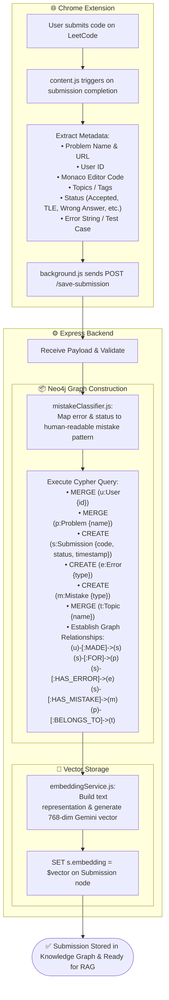
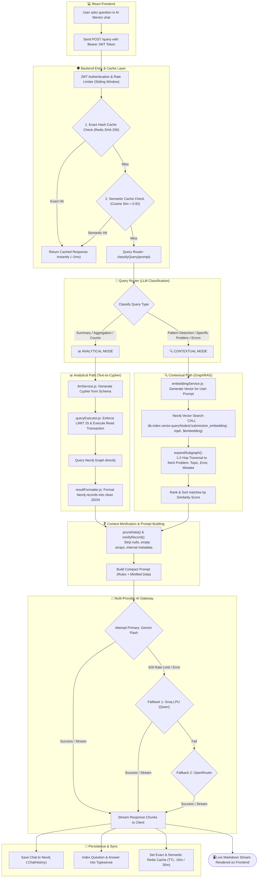

# 📐 System Architecture & Data Flowcharts

This document outlines the complete end-to-end architecture of the **GraphRAG Mentor** system, covering both the **Data Ingestion Pipeline** and the **AI Query & GraphRAG Pipeline**.

---

## Table of Contents
1. [Flow 1: Data Ingestion Pipeline (Extension ➔ Neo4j & Embeddings)](#-flow-1-data-ingestion-pipeline-extension--neo4j--embeddings)
   - [Mermaid Diagram](#11-mermaid-diagram)
   - [Boxed ASCII Diagram](#12-boxed-ascii-diagram)
2. [Flow 2: AI Mentor Query, Routing & GraphRAG Flow](#-flow-2-ai-mentor-query-routing--graphrag-flow)
   - [Mermaid Diagram](#21-mermaid-diagram)
   - [Boxed ASCII Diagram](#22-boxed-ascii-diagram)

---

# 📦 Flow 1: Data Ingestion Pipeline (Extension ➔ Neo4j & Embeddings)

### 1.1 Mermaid Diagram



### 1.2 Boxed ASCII Diagram

```
┌─────────────────────────────────────────────────────────────┐
│                 🌐 CHROME EXTENSION (LeetCode)              │
│                                                             │
│  • User submits code on LeetCode                            │
│  • content.js extracts:                                     │
│     - Problem Name & URL                                    │
│     - Monaco Editor Code                                    │
│     - Submission Status (Accepted, TLE, Wrong Answer, etc.) │
│     - Error string / Test case input                        │
│     - Problem Topic Tags                                    │
└──────────────────────────────┬──────────────────────────────┘
                               │
                               │  chrome.runtime.sendMessage()
                               ▼
┌─────────────────────────────────────────────────────────────┐
│                 📡 EXTENSION BACKGROUND SCRIPT              │
│                                                             │
│  • Sends HTTP POST /save-submission to Backend              │
│  • Payload: { userId, problem, code, status, error, topics }│
└──────────────────────────────┬──────────────────────────────┘
                               │
                               │  HTTP POST (JSON)
                               ▼
┌─────────────────────────────────────────────────────────────┐
│               ⚙️ EXPRESS BACKEND (server.js)                │
│                                                             │
│  • utils/mistakeClassifier.js:                              │
│     - Maps error & status to human-readable mistake reason  │
│     - Handles TLE ("Not optimized approach")                │
│     - Handles Accepted ("Solution is correct...")           │
└──────────────────────────────┬──────────────────────────────┘
                               │
                               │  Cypher Execution (driver.session)
                               ▼
┌─────────────────────────────────────────────────────────────┐
│                🗄️ NEO4J KNOWLEDGE GRAPH ENGINE              │
│                                                             │
│  • MERGE (u:User {id})                                      │
│  • MERGE (p:Problem {name})                                 │
│  • CREATE (s:Submission {code, status, timestamp})          │
│  • CREATE (e:Error {type})                                  │
│  • CREATE (m:Mistake {type})                                │
│  • MERGE (t:Topic {name})                                   │
│  • Connect Relationships:                                   │
│     (u)-[:MADE]->(s)-[:FOR]->(p)-[:BELONGS_TO]->(t)         │
│     (s)-[:HAS_ERROR]->(e), (s)-[:HAS_MISTAKE]->(m)          │
└──────────────────────────────┬──────────────────────────────┘
                               │
                               │  Returns submissionId
                               ▼
┌─────────────────────────────────────────────────────────────┐
│              🧠 GEMINI EMBEDDING PIPELINE                   │
│                                                             │
│  • utils/embeddingService.js:                               │
│     - Composes text representation of submission            │
│     - Calls gemini-embedding-001 (768 dimensions)           │
│  • Stores vector directly on node:                          │
│     MATCH (s) SET s.embedding = $vector                     │
└──────────────────────────────┬──────────────────────────────┘
                               │
                               ▼
┌─────────────────────────────────────────────────────────────┐
│       ✅ STORED & INDEXED (Ready for GraphRAG Search)       │
└─────────────────────────────────────────────────────────────┘
```

---

# 🧠 Flow 2: AI Mentor Query, Routing & GraphRAG Flow

### 2.1 Mermaid Diagram



### 2.2 Boxed ASCII Diagram

```
┌─────────────────────────────────────────────────────────────┐
│                    💻 REACT FRONTEND CHAT                   │
│                                                             │
│  • User enters prompt: "Why am I failing Tree questions?"   │
│  • Sends POST /query with Bearer JWT Token                  │
└──────────────────────────────┬──────────────────────────────┘
                               │
                               │  HTTP POST (Bearer Token)
                               ▼
┌─────────────────────────────────────────────────────────────┐
│              🛡️ AUTH & TWO-TIER REDIS CACHING               │
│                                                             │
│  • Verify JWT Token + Apply User Rate Limiter               │
│                                                             │
│  [Tier 1: Exact Cache]                                      │
│   └─ SHA-256 Hash of prompt found in Redis?                 │
│        ├─► (YES) ──► Return response instantly (<2ms) ──────┼──┐
│        └─► (NO)                                             │  │
│  [Tier 2: Semantic Vector Cache]                            │  │
│   └─ Embed question ➔ Cosine Similarity > 0.92?             │  │
│        ├─► (YES) ──► Return cached response (~10ms) ────────┼──┤
│        └─► (NO)                                             │  │
└──────────────────────────────┬──────────────────────────────┘  │
                               │ (Cache Miss)                    │
                               ▼                                 │
┌─────────────────────────────────────────────────────────────┐  │
│             🔀 QUERY ROUTER (AI Classification)             │  │
│                                                             │  │
│  • Classifies query intent into one of two pipelines:       │  │
└──────────────┬──────────────────────────────┬───────────────┘  │
               │                              │                  │
      [ANALYTICAL MODE]              [CONTEXTUAL MODE]           │
      (Counts, Trends, History)      (Why did I fail? Patterns)  │
               │                              │                  │
               ▼                              ▼                  │
┌─────────────────────────────┐┌─────────────────────────────┐   │
│   📊 TEXT-TO-CYPHER PATH    ││     🔍 GRAPHRAG PATH        │   │
│                             ││                             │   │
│ 1. llmService.js:           ││ 1. Embed user query using   │   │
│    Generate Cypher from DB  ││    Gemini Embeddings        │   │
│    Schema + Prompt Rules    ││                             │   │
│ 2. queryExecutor.js:        ││ 2. Neo4j Native Vector      │   │
│    Auto-appends LIMIT 25    ││    Search (Top-K matches)   │   │
│    Runs Read Transaction    ││                             │   │
│ 3. resultFormatter.js:      ││ 3. expandSubgraph():        │   │
│    Converts Neo4j records   ││    1-2 hop graph expansion  │   │
│    to clean JSON            ││    (Problem, Error, Topic)  │   │
└──────────────┬──────────────┘└──────────────┬──────────────┘   │
               │                              │                  │
               └──────────────┬───────────────┘                  │
                              │ Raw Context                      │
                              ▼                                  │
┌─────────────────────────────────────────────────────────────┐  │
│          🗜️ CONTEXT PRUNING & DATA MINIFICATION             │  │
│                                                             │  │
│  • Strips nulls, empty arrays, redundant internal IDs       │  │
│  • Compacts JSON / Shortens prompt rules (Saves ~65% tokens)│  │
└──────────────────────────────┬──────────────────────────────┘  │
                               │ Minified Prompt                 │
                               ▼                                 │
┌─────────────────────────────────────────────────────────────┐  │
│            🚀 MULTI-PROVIDER AI GATEWAY ENGINE              │  │
│                                                             │  │
│   ┌─────────────────────────────────────────────────────┐   │  │
│   │ 1. Primary: Google Gemini Flash (15 RPM Quota)      │   │  │
│   └──────────────────────────┬──────────────────────────┘   │  │
│       Rate Limit (429) / Fail│                              │  │
│                              ▼                              │  │
│   ┌─────────────────────────────────────────────────────┐   │  │
│   │ 2. Fallback 1: Groq LPU - Qwen (30 RPM Ultra-Fast)  │   │  │
│   └──────────────────────────┬──────────────────────────┘   │  │
│       Rate Limit (429) / Fail│                              │  │
│                              ▼                              │  │
│   ┌─────────────────────────────────────────────────────┐   │  │
│   │ 3. Fallback 2: OpenRouter - Gemma 3 (Free Tier)     │   │  │
│   └─────────────────────────────────────────────────────┘   │  │
└──────────────────────────────┬──────────────────────────────┘  │
                               │ Streamed Text Chunks            │
                               ▼                                 │
┌─────────────────────────────────────────────────────────────┐  │
│               💾 PERSISTENCE & CACHE UPDATE                 │  │
│                                                             │  │
│  • Save message pair to Neo4j (:ChatHistory)                │  │
│  • Index question into Typesense for instant fuzzy search   │  │
│  • Store answer in Redis (Exact: 10m TTL, Semantic: 30m TTL)│  │
└──────────────────────────────┬──────────────────────────────┘  │
                               │                                 │
                               ▼                                 ▼
┌────────────────────────────────────────────────────────────────┐
│      🖥️ RESPONSE STREAMED LIVE TO REACT FRONTEND (Markdown)    │
└────────────────────────────────────────────────────────────────┘
```
